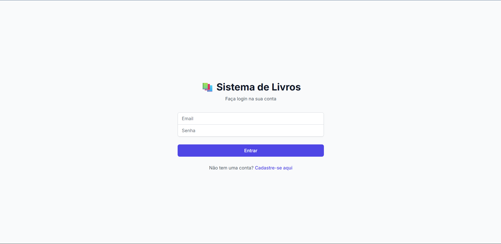
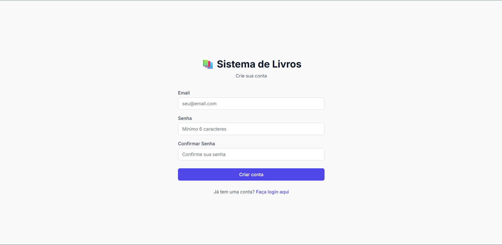
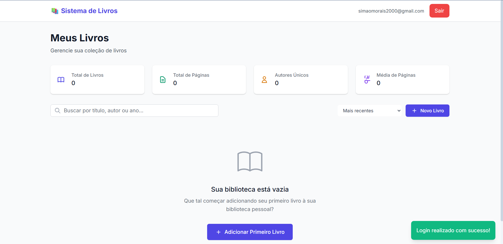
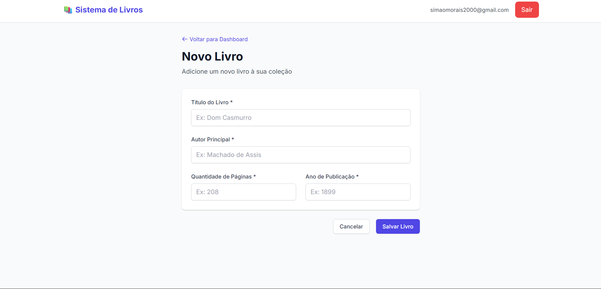
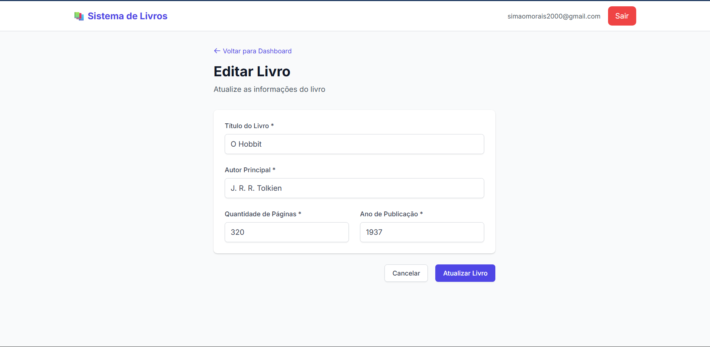
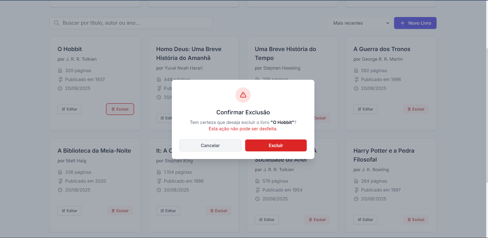

# Sistema Bibliotecario

Sistema CRUD para gerenciamento de livros utilizando Vue 3 no frontend, Node.js/Express no backend e Supabase como banco de dados e autenticação.

## 📋 Funcionalidades

- **Autenticação**: Login com email e senha via Supabase
- **CRUD Completo de Livros**:
  - Criar novo livro
  - Listar todos os livros
  - Atualizar livro existente
  - Deletar livro
- **Validações**: Campos obrigatórios e formatos
- **Mensagens**: Feedback de sucesso/erro para o usuário
- **Interface Responsiva**: Design moderno e intuitivo

## 🛠️ Tecnologias

### Frontend
- **Vue 3** - Framework JavaScript reativo
- **Axios** - Cliente HTTP para consumir APIs
- **Vue Router** - Roteamento
- **Tailwind CSS** - Estilização

### Backend
- **Node.js** - Runtime JavaScript
- **Express** - Framework web
- **Supabase** - Banco PostgreSQL + Autenticação
- **CORS** - Middleware para permitir requisições cross-origin

<!-- ## 🗂️ Estrutura do Projeto

```
sistema-livros/
├── client/                 # Frontend Vue 3
│   ├── src/
│   │   ├── components/     # Componentes Vue
│   │   ├── views/          # Páginas/Views
│   │   ├── router/         # Configuração de rotas
│   │   ├── services/       # Serviços (API calls)
│   │   └── main.js         # Arquivo principal
│   ├── public/
│   ├── package.json
│   └── index.html
├── server/                 # Backend Node.js
│   ├── routes/             # Rotas da API
│   ├── middleware/         # Middlewares
│   ├── config/             # Configurações
│   ├── server.js           # Arquivo principal do servidor
│   └── package.json
└── README.md
``` -->

## ⚙️ Configuração do Supabase

### 1. Criar conta no Supabase
1. Acesse [supabase.com](https://supabase.com)
2. Crie uma conta gratuita
3. Crie um novo projeto

### 2. Configurar tabela de livros
Execute este SQL no editor do Supabase:

```sql
-- Criar tabela de livros
CREATE TABLE livros (
  id UUID DEFAULT gen_random_uuid() PRIMARY KEY,
  titulo VARCHAR(255) NOT NULL,
  autor_principal VARCHAR(255) NOT NULL,
  quantidade_paginas INTEGER NOT NULL CHECK (quantidade_paginas > 0),
  ano_publicacao INTEGER NOT NULL CHECK (ano_publicacao > 0),
  user_id UUID REFERENCES auth.users(id) ON DELETE CASCADE,
  created_at TIMESTAMP WITH TIME ZONE DEFAULT NOW(),
  updated_at TIMESTAMP WITH TIME ZONE DEFAULT NOW()
);

-- Habilitar RLS (Row Level Security)
ALTER TABLE livros ENABLE ROW LEVEL SECURITY;

-- Política para usuários autenticados
CREATE POLICY "Usuários podem gerenciar seus próprios livros" ON livros
  FOR ALL USING (auth.uid() = user_id);

-- Trigger para atualizar updated_at
CREATE OR REPLACE FUNCTION update_updated_at_column()
RETURNS TRIGGER AS $$
BEGIN
    NEW.updated_at = NOW();
    RETURN NEW;
END;
$$ language 'plpgsql';

CREATE TRIGGER update_livros_updated_at 
    BEFORE UPDATE ON livros 
    FOR EACH ROW 
    EXECUTE FUNCTION update_updated_at_column();
```

### 3. Obter credenciais
No painel do Supabase, vá em Settings > API e copie:
- Project URL
- anon/public key

## 🚀 Instalação e Execução

### Pré-requisitos
- Node.js 16+ instalado
- npm ou yarn
- Conta no Supabase configurada

### 1. Clonar o repositório
```bash
git clone <seu-repositorio>
cd sistema-livros
```

### 2. Configurar Backend

```bash
cd server
npm install
```

Criar arquivo `.env`:
```env
PORT=3001
SUPABASE_URL=sua_supabase_url_aqui
SUPABASE_ANON_KEY=sua_supabase_anon_key_aqui
```

Iniciar servidor:
```bash
npm start
# ou para desenvolvimento:
npm run dev
```

### 3. Configurar Frontend

```bash
cd ../client
npm install
```

Criar arquivo `.env`:
```env
VITE_API_BASE_URL=http://localhost:3001
VITE_SUPABASE_URL=sua_supabase_url_aqui
VITE_SUPABASE_ANON_KEY=sua_supabase_anon_key_aqui
```

Iniciar aplicação:
```bash
npm run dev
```

<!-- ## 📡 API Endpoints

### Autenticação
- `POST /auth/login` - Login do usuário
- `POST /auth/register` - Registro de novo usuário
- `POST /auth/logout` - Logout

### Livros
- `GET /api/livros` - Listar todos os livros do usuário
- `GET /api/livros/:id` - Buscar livro por ID
- `POST /api/livros` - Criar novo livro
- `PUT /api/livros/:id` - Atualizar livro
- `DELETE /api/livros/:id` - Deletar livro

### Exemplo de requisição - Criar livro:
```json
POST /api/livros
Authorization: Bearer <token>
Content-Type: application/json

{
  "titulo": "Dom Casmurro",
  "autor_principal": "Machado de Assis",
  "quantidade_paginas": 208,
  "ano_publicacao": 1899
}
``` -->
# 📸 Telas da Aplicação

Esta seção apresenta as telas principais do **Sistema de Livros**, descrevendo suas funcionalidades e incluindo imagens ilustrativas.

---

## 🖥️ Telas de Autenticação

### 📌 Descrição:
As telas de login e cadastro permitem que os usuários acessem e criem suas contas no sistema de forma segura.

#### Tela de Login


#### Tela de Cadastro


---

## 📊 Dashboard Principal

### 📌 Descrição:
O dashboard é a tela principal onde o usuário gerencia sua coleção de livros. Ele exibe estatísticas e a lista de livros cadastrados.

### 🔹 Funcionalidades:
- Exibição de estatísticas (Total de Livros, Páginas, etc.).
- Campo de busca para encontrar livros por título, autor ou ano.
- Botão para adicionar um novo livro.
- Listagem dos livros em formato de cards.
- Opções para editar ou excluir cada livro.

### 🖼️ Imagens:

#### Dashboard com a biblioteca vazia


#### Dashboard com livros cadastrados


---

## 📖 Tela de Adicionar Novo Livro

### 📌 Descrição:
Formulário para adicionar um novo livro à coleção do usuário.

### 🔹 Funcionalidades:
- Campo para **Título** do livro.
- Campo para **Autor Principal**.
- Campo para **Quantidade de Páginas**.
- Campo para **Ano de Publicação**.
- Botões para **Salvar** ou **Cancelar**.

### 🖼️ Imagem:


---

## ✏️ Tela de Editar Livro

### 📌 Descrição:
Permite que o usuário modifique as informações de um livro que já foi cadastrado.

### 🔹 Funcionalidades:
- Campos pré-preenchidos com as informações atuais do livro.
- Botão **Atualizar Livro** para salvar as alterações.

### 🖼️ Imagem:


---

## 🗑️ Confirmação de Exclusão

### 📌 Descrição:
Um modal de confirmação é exibido para garantir que o usuário realmente deseja excluir um livro, evitando remoções acidentais.

### 🖼️ Imagem:


---

<!-- ## 🔒 Segurança

- **Autenticação JWT**: Tokens seguros via Supabase
- **Row Level Security**: Usuários só acessam seus dados
- **Validação**: Frontend e backend validam dados
- **CORS**: Configurado para permitir apenas origens autorizadas
- **Sanitização**: Dados sanitizados antes de persistir -->

## 🧪 Testes

Para testar a aplicação:

1. **Registro**: Crie uma nova conta
2. **Login**: Faça login com as credenciais
3. **CRUD**: Teste todas as operações de livros
4. **Validação**: Teste campos obrigatórios e formatos
5. **Autenticação**: Teste logout e acesso não autorizado

<!-- ## 📦 Scripts Disponíveis

### Frontend (client/)
- `npm run dev` - Servidor de desenvolvimento
- `npm run build` - Build para produção
- `npm run preview` - Preview do build

### Backend (server/)
- `npm start` - Servidor em produção
- `npm run dev` - Servidor com nodemon (desenvolvimento)

## 🔧 Customização

### Adicionar novos campos:
1. Atualize a tabela no Supabase
2. Modifique os modelos no backend
3. Atualize os formulários no frontend

### Alterar estilização:
- Modifique as classes Tailwind CSS nos componentes Vue
- Customize cores e temas no arquivo de configuração -->

<!-- ## ❗ Solução de Problemas

### Erro de CORS:
Verifique se o backend está rodando na porta correta e se o CORS está configurado.

### Erro de autenticação:
Confirme se as credenciais do Supabase estão corretas no arquivo `.env`.

### Erro de conexão com banco:
Verifique se as políticas RLS estão configuradas corretamente.

## 📝 Contribuição

1. Fork o projeto
2. Crie uma branch para sua feature (`git checkout -b feature/AmazingFeature`)
3. Commit suas mudanças (`git commit -m 'Add some AmazingFeature'`)
4. Push para a branch (`git push origin feature/AmazingFeature`)
5. Abra um Pull Request -->

## 📄 Licença

Este projeto está sob a licença MIT. Veja o arquivo `LICENSE` para mais detalhes.

---

**Desenvolvido para exercitar conceitos de Sistemas Distribuídos**